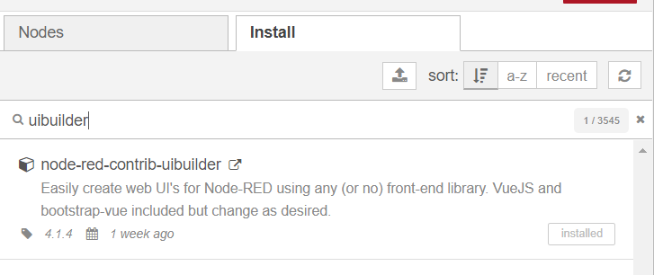
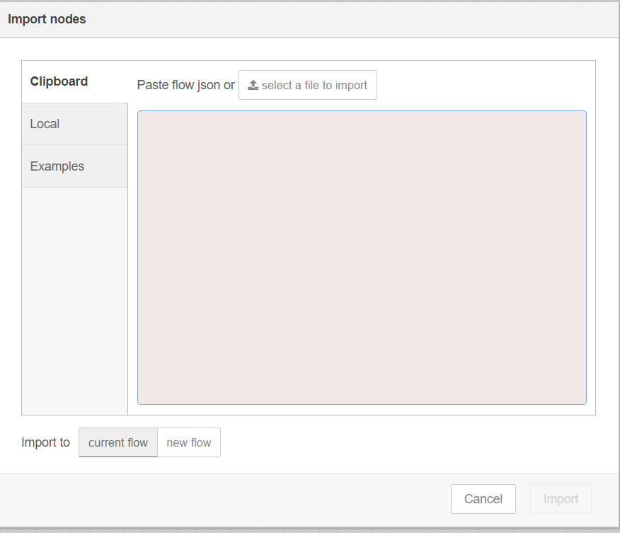
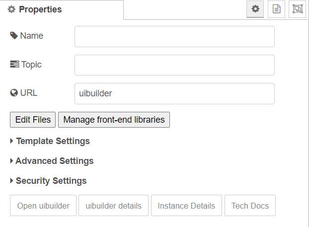

# SampleWebAPP using UIBuilder Node Module

SampleWebApp is a build based on the UIBuilder Node-RED community module which fetches the data from OEI RestDataExport and display as a web application.

>**Note:** In this document, you will find labels of 'Edge Insights for Industrial (EII)' for filenames, paths, code snippets, and so on. Consider the references of EII as Open Edge Insights (OEI). This is due to the product name change of EII as OEI.

## Installing UI Builder Node

Go to the `Palette Manager` and install the UI Builder.

> **Note**
> For more details on Pallete Manager, refer to the [Pallete Manager](https://nodered.org/docs/user-guide/editor/palette/manager) documentation.

## Import OEISampleAPP Flows

Complete the following steps to import the OEISampleApp workflows:

1. Import the Workflow [flows.json](./flows.json) file to the Node-RED dashboard using the `menu` icon on top-right corner as follows:

   

2. Click `Import`.

3. Update `url` in all nodes wherever applicable and use `https` if you are running RDE in the `Prod` mode.

## Editing Files of UI Builder

To make changes to the UI Builder files, complete the following steps:

1. `Double Click` the UI Builder Node and edit and copy the content of the following files to the UI builder Node-RED files in the **Edit Files** section.

   - [index.html](./index.html)
   - [index.css](./index.css)
   - [index.js](./index.js)

   

2. Save the files
   >**Note:** Ensure that the flow is deployed.

## Accesing UI Builder

Access UI Builder App from the following `Endpoint`:
http://<url:port>/uibuilder/
