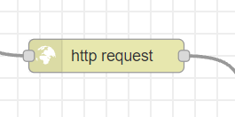
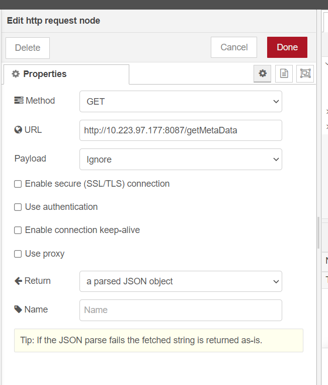
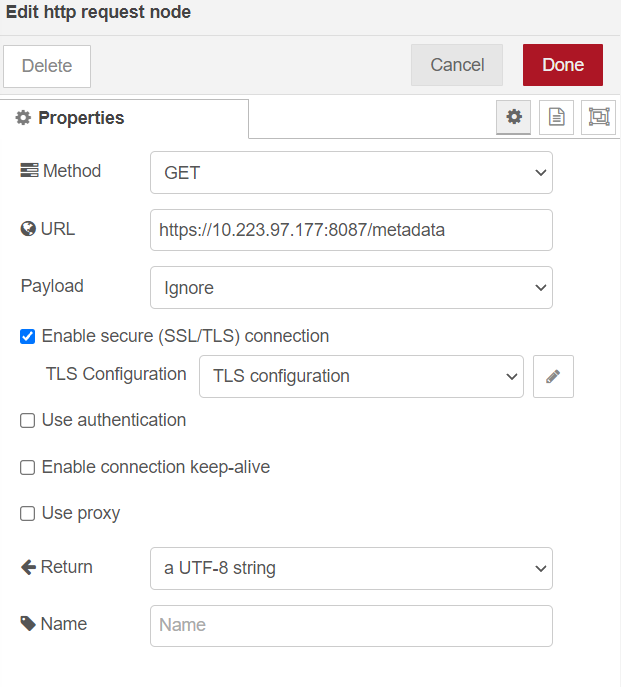
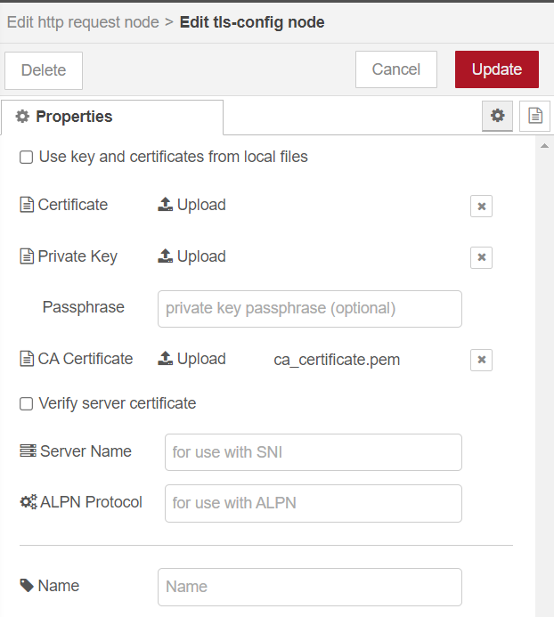
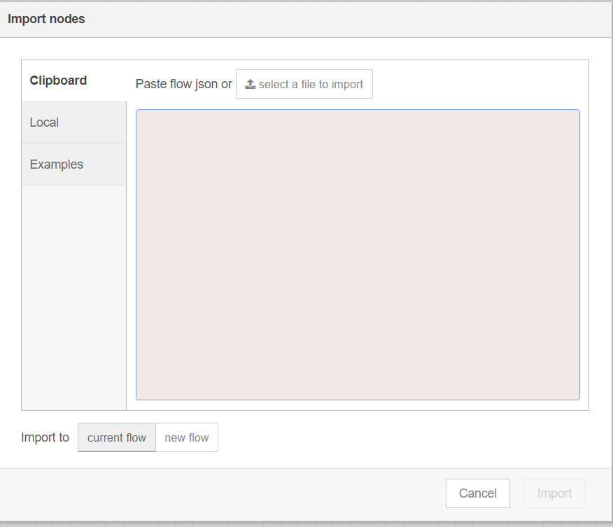

# NodeRedHttpClientApp

This NodeRed in built http node based client App acts as client for the EII RestDataExport and brings the EII Classifier data to NodeRed ecosystem.

## Setting Up NodeRed

1. For setting up NodeRed in your environment, NodeRed is providing various options to install and up.
   Please follow the below documenation link of NodeRed for its setup.

   <https://nodered.org/docs/getting-started/local>

   >**Note**: For quick setup, Install using `docker`
   >
   > ```sh
   >    docker run -it -p 1880:1880 --name myNodeRed nodered/node-red
   > ```
   >
## Getting EII UDF Classifier results data to NodeRed Environment Using NodeRed HTTPClient

> **Note**: RestDataExport should be running already as a prerequisite.  
> Please refer the RestDataExport [Readme](https://github.com/open-edge-insights/eii-rest-data-export)

1. Drag the `http request` node of nodered's default nodes to your existing workflow.

      

2. Update the `properties` of node as below

   DEV Mode:
      * Please follow the below dialog properties for setting DEV Mode in NodeRed dashboard

         

   PROD Mode:
      * Please follow the below dialog properties for setting DEV Mode in NodeRed dashboard

         

      * For Prod Mode TLS `ca_certificate.pem` import.
         **Note**: This `ca_certificate.pem` will be part EII certificate bundle. Please refer `EII/build/provision/Certificates/` directory.

         

   > **Note**:
   >
   >    1. For `DEV` mode no need to enable/attach the certificates
   >    2. Update the `ip` address as per `RestDataExport` module running machine ip.
   >    3. For more details on NodeRed's `http request` module, please refer: <https://stevesnoderedguide.com/node-red-http-request-node-beginners>

## Sample Workflow

The attached workflow document is sample workflow by updating the `RestDataExport` IP Address in `http request` module,

* Import the Sample Workflow [flows.json](./flows.json) file to NodeRed dashboard using `menu` icon in top right corner as follows

  

* Click `Import` Button

* Update the `URL` of `http request` node with `RestDataExport` module running machine IP Address

**Note**:

   1. For detail please refer <https://nodered.org/docs/user-guide/editor/workspace/import-export>
   2. The classifier results will be logged in debug window.
